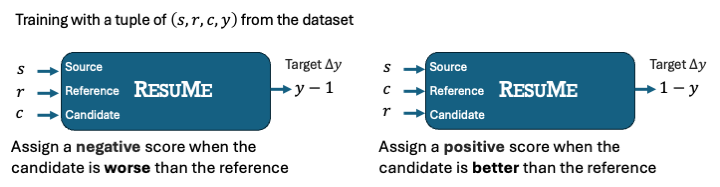

# ResuMe: The Residual Score Metric for Machine Translation

Welcome to the official repository for the paper: [Beyond Reference: Evaluating High Quality Translations Better than Human References](https://aclanthology.org/2024.emnlp-main.294) (EMNLP 2024)

ResuMe is the first reference-based MT metric that does not consider the human reference translation as a “perfect” gold standard where an MT output is compared.

## 1. Paper Abstract

In Machine Translation (MT) evaluations, the conventional approach is to compare a translated sentence against its human-created reference sentence. MT metrics provide an absolute score (e.g., from 0 to 1) to a candidate sentence based on the similarity with the reference sentence. Thus, existing MT metrics give the maximum score to the reference sentence. However, this approach overlooks the potential for a candidate sentence to exceed the reference sentence in terms of quality. In particular, recent advancements in Large Language Models (LLMs) have highlighted this issue, as LLM-generated sentences often exceed the quality of human-written sentences. To address the problem, we introduce the Residual score Metric (ResuMe), which evaluates the relative quality between reference and candidate sentences. ResuMe assigns a positive score to candidate sentences that outperform their reference sentences, and a negative score when they fall short. By adding the residual scores from ResuMe to the absolute scores from MT metrics, it can be possible to allocate higher scores to candidate sentences than what reference sentences are received from MT metrics. Experimental results demonstrate that ResuMe enhances the alignments between MT metrics and human judgments both at the segment-level and the system-level.

## 2. Pre-requisition

ResuMe is implemented using the **COMET package**, a tool for the machine translation metric. Follow the steps below to install the necessary dependencies.

1. Upgrade `pip` to the latest version:

  ```
  pip install --upgrade pip
  ```

2. Install the COMET package

  ```
  pip install unbabel-comet
  ```

For detailed installation instructions, troubleshooting, and supported features, visit the official [the COMET repository](https://github.com/Unbabel/COMET).

Ensure your Python environment is properly set up and compatible with the COMET package before proceeding.

## 3. Preparing training data
<p align="center">
  
</p>

The direct annotation (DA) data of the WMT metric shared tasks were used to train ResuMe.

### 3.1. Data Requirements

Ensure the datasets meet the following requirements to train ResuMe using the COMET packages.

- The data should be saved in a CSV format.
- The data should include the following columns.
    - `src`: Source sentence
    - `ref`: Reference sentence
    - `cand`: Candidate (machine-translated) sentence
    - `score`: human ratings ranging from 0 to 100 (DA annotation in the WMT metric shared task)

### 3.2. Generating Relative (Residual) Scores

Once the dataset is prepared according to the requirements, you can use the following script in this repository to generate the relative (residual) scores for ResuMe training. 

```
python generate_relative_score_data.py --csv_data_path <data_file_name> --output_path <output_file_save_path>
```

- `—-csv_data_path <data_file_name>`: Path to the input CSV file containing the dataset
- `--output_path <output_file_save_path>`: Path where the processed data will be saved.

### 3.3. Training

**Step1**. Create a model configure file

- Refer to [the model configuration files](https://github.com/Unbabel/COMET/tree/master/configs/models) in the COMET repository to create a YAML configuration file tailored to your training needs.

**Step2**. Train the model

- Use the `comet-train` command with your configuration file to start training

```
comet-train --cfg <your_config_file>.yaml
```

- `--cfg <your_config_file>.yaml`: Path where the the model configuration yaml file is saved.

For more detailed information on training options and configuration file settings, visit the [COMET GitHub repository](https://github.com/Unbabel/COMET)

## 4. Models

We release checkpoints that are built on top of the unified metric architecture in the COMET repository. Download and unzip files.

- ResuMe18-base: This model is trained using the WMT 17-18 DA datasets and built on the InfoXLM-base model.
- ResuMe19-base: This model is trained using the WMT 17-19 DA datasets and built on the InfoXLM-base model.
- ResuMe20-base: This model is trained using the WMT 17-20 DA datasets and built on the InfoXLM-base model.
- ResuMe20-large: This model is trained using the WMT 17-20 DA datasets and built on the InfoXLM-large model.

Using the `comet-score` command, you can run the provided checkpoints.

```
comet-score -s <source.txt> -t <candidate.txt> -r <reference.txt> --model PATH/TO/CHECKPOINT
```

- `<source.txt>`: Path to the file containing source sentences.
- `<candidate.txt>`: Path to the file containing candidate translations.
- `<reference.txt>`: Path to the file containing reference translations.
- `-model PATH/TO/CHECKPOINT`: Path to the downloaded checkpoint.

For detailed usage and additional options, refer to the official [COMET repository](https://github.com/Unbabel/COMET).

**※ Recommendation Usage ※**

We recommend using ResuMe's residual scores with other reference-based MT metrics. By adding ResuMe's relative scores to the absolute scores (e.g., from 0 to 1)of existing metrics, you can enhance the alignment with human judgments at both the segment and system levels, while addressing the reference-bias problem inherent in traditional MT metrics. ResuMe also enables accurate evaluation of candidate translations that surpass the quality of human references. For detailed methodology, experimental results, and implementation specifics, please refer to our [EMNLP 2024 paper](https://aclanthology.org/2024.emnlp-main.294).

## Citation

```
@inproceedings{noh-etal-2024-beyond,
    title = "Beyond Reference: Evaluating High Quality Translations Better than Human References",
    author = "Noh, Keonwoong  and
      Oh, Seokjin  and
      Jung, Woohwan",
    editor = "Al-Onaizan, Yaser  and
      Bansal, Mohit  and
      Chen, Yun-Nung",
    booktitle = "Proceedings of the 2024 Conference on Empirical Methods in Natural Language Processing",
    month = nov,
    year = "2024",
    address = "Miami, Florida, USA",
    publisher = "Association for Computational Linguistics",
    url = "https://aclanthology.org/2024.emnlp-main.294",
    doi = "10.18653/v1/2024.emnlp-main.294",
    pages = "5111--5127",
    abstract = "In Machine Translation (MT) evaluations, the conventional approach is to compare a translated sentence against its human-created reference sentence. MT metrics provide an absolute score (e.g., from 0 to 1) to a candidate sentence based on the similarity with the reference sentence. Thus, existing MT metrics give the maximum score to the reference sentence. However, this approach overlooks the potential for a candidate sentence to exceed the reference sentence in terms of quality. In particular, recent advancements in Large Language Models (LLMs) have highlighted this issue, as LLM-generated sentences often exceed the quality of human-written sentences. To address the problem, we introduce the Residual score Metric (ResuMe), which evaluates the relative quality between reference and candidate sentences. ResuMe assigns a positive score to candidate sentences that outperform their reference sentences, and a negative score when they fall short. By adding the residual scores from ResuMe to the absolute scores from MT metrics, it can be possible to allocate higher scores to candidate sentences than what reference sentences are received from MT metrics. Experimental results demonstrate that ResuMe enhances the alignments between MT metrics and human judgments both at the segment-level and the system-level.",
}
```
